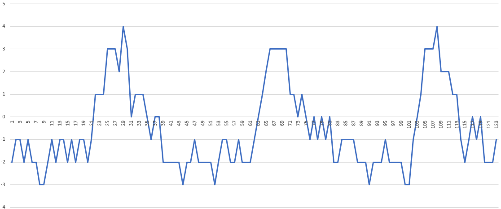
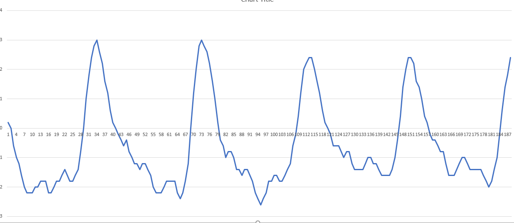
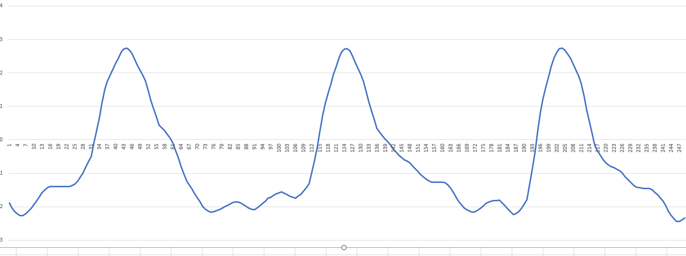
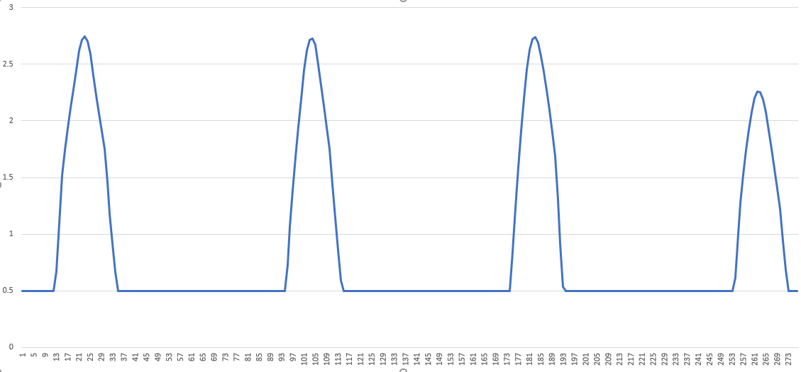
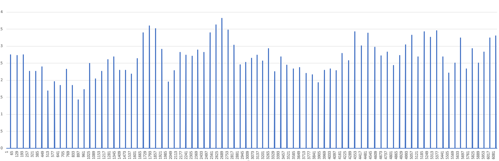

# Espruino HRV (Heart Rate Variability)
Espruino based HRV monitor using the Bangle.JS. This should be quite easy to transfer for use on other HR trackers that can run espruino.

File contents:
-HRV.js
  HRV script to be uploaded to the Bangle.js
-HRV_node_version.js
  This is a JS script that can be used with node for general use - you can process larger ammounts of data on a PC this way rather than trying to do it all on the Bangle. You just need to keep a HR_log.csv file in the same folder - this log files is generated by the HRV.js script when run and that script can be modified to take readings over a longer period.
-HR_logs
  These are sample logs, along with the associated raw HR readings that show how the signal looks after each stage of processing, the images below are from the same set. These logs can be generated by running the node version of the script outlined above.

Essentially the HRV.js works this way:
1.	Take raw hrm readings for ~20 seconds
2.	Rolling average filter to ommit noise
3.	Upscale the signal – I’ve used interpolation of bezier curves to double the sample count
4.	Another slight rolling average
5.	The next stage is to find peaks in the data and so before doing that the script applies clipping so it doesn’t search for lower level peaks that don’t matter
6.	Find all peaks – I’ve used a slope inversion algorythm for this
7.	Standard deviation of the gaps between peaks and then mutiply by the frequency to get HRV. The script also calculates HR based on gap sizes and then displays these details

I'd like to have taken more readings than just 20 seconds but there are memory limitations to contend with, to get around this it's quite easy to just take several readings and do an average for yourself; taking several HRV readings over 5mins or so is generally recommended anyway.

a few other notes:
-it might be possible to get away with just linear interpolation or something faster but similar than what i've done for steps 3 & 4
-sometimes the processing loop gets executed twice and that's probably because of my ignorance of asynchronous programming in Javascript rather than an actual bug. May need to revise the event handling to fix this - it doesn't actually affect the end result and the final readings though.

<ins>Raw Reading</ins>

<ins>Rolling Average</ins>

<ins>Upscale</ins>

<ins>Clipping</ins>

<ins>Peaks found</ins>
You can see here the algorythm appears to correctly identify pretty much every relevant peak from the PPG data. It's also sadly clear that I have a crap HRV right now.

